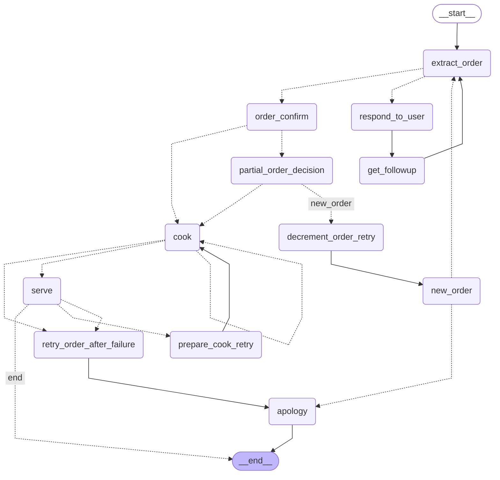

# Restaurant LangGraph Agent

Run the agent from this directory:

```powershell
uv run python restuarant.py
```

The graph uses Mermaid, so no ASCII layout dependency is required. Open this file in VS Code and run **Markdown: Open Preview** to see the flow visually.

## LangGraph Flow



The CLI also prints the same Mermaid source after each run. The execution log shows the node name, status, order details, and remaining retries.

## Testing

Run the deterministic automated tests from this directory:

```powershell
uv run python -m unittest discover -s tests -v
```

These tests mock Groq and verify:

- A successful order: `extract_order -> order_confirm -> cook -> serve -> END`
- Cook failure twice, followed by recovery and apology
- Serve failure twice, including cook retries, followed by recovery and apology

Run the real interactive workflow with the Groq API:

```powershell
uv run python restuarant.py
```

Try inputs such as:

```text
I am hungry, what is on the menu?
I want 2 chicken biryani
Can you debug my Python code?
```

The last request should be refused because the assistant is restricted to restaurant ordering. The `.env` file must contain a valid `GROQ_API_KEY` for this live test.

The automated tests use `cook_outcomes` and `serve_outcomes` so failures are reproducible. For example:

```python
initial_state(
  "I want 2 chicken biryani",
  cook_outcomes=["failure", "success"],
  serve_outcomes=["failure", "success"],
)
```

Use the printed `NODE`, `STATUS`, `cook_retries`, `serve_retries`, `cook_attempt`, and `serve_attempt` values to inspect each state transition.
